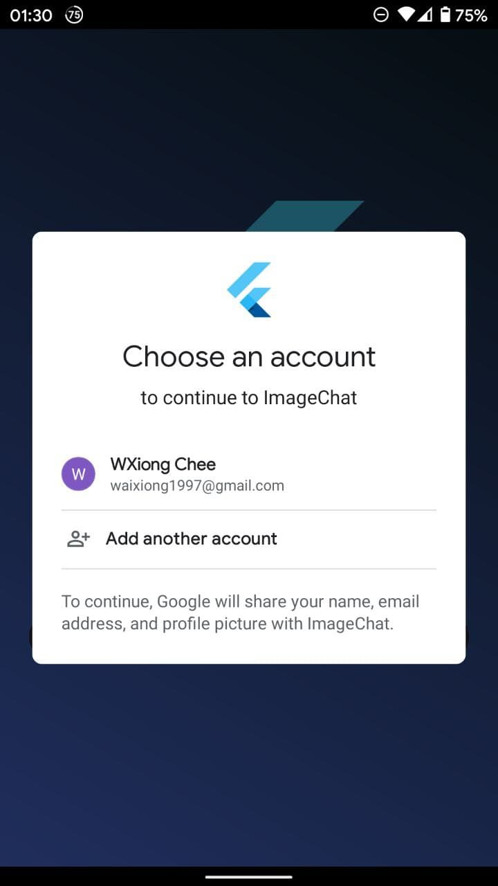
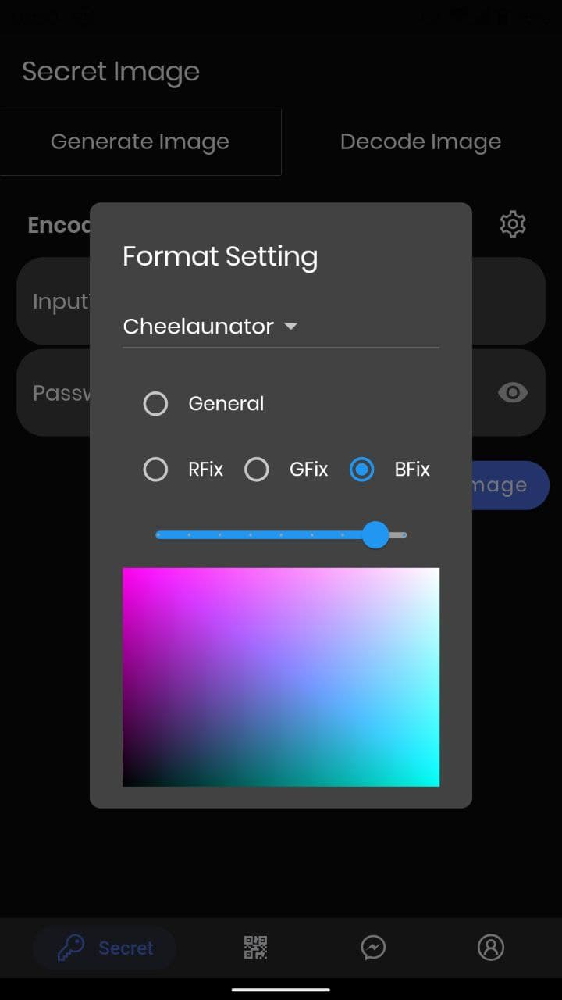
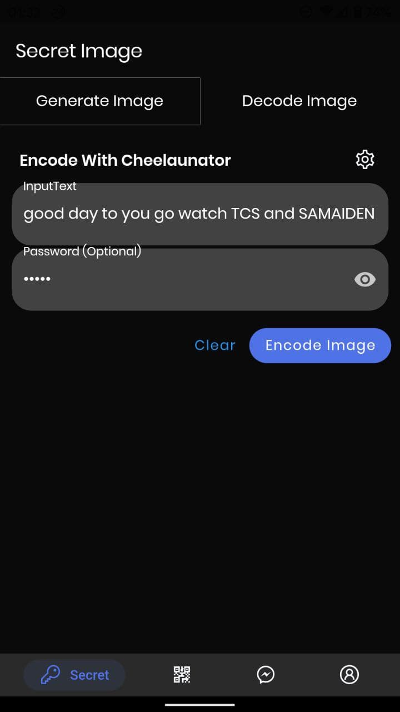
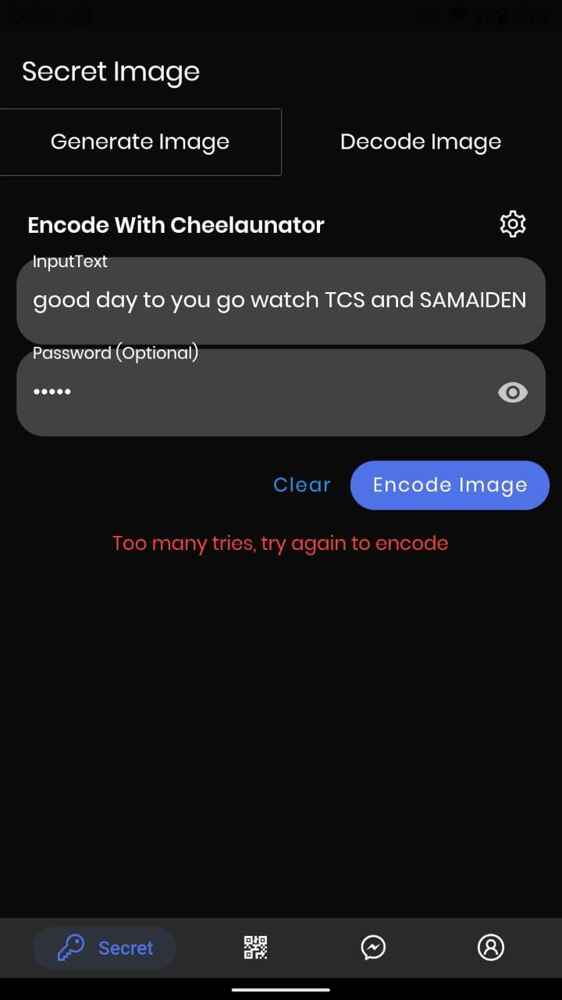
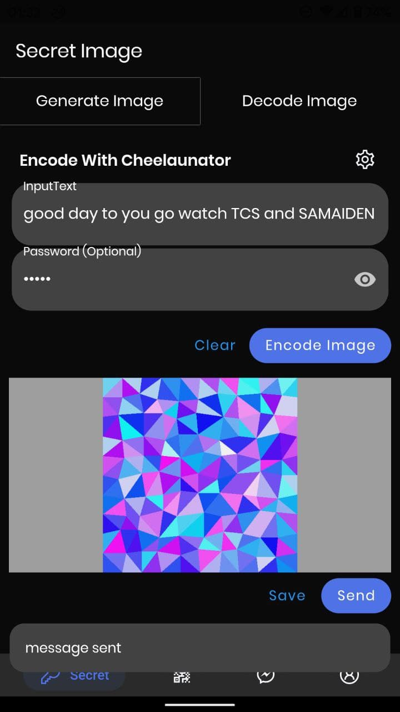
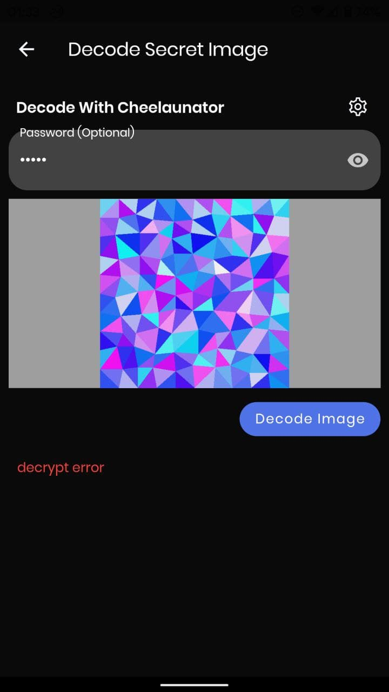
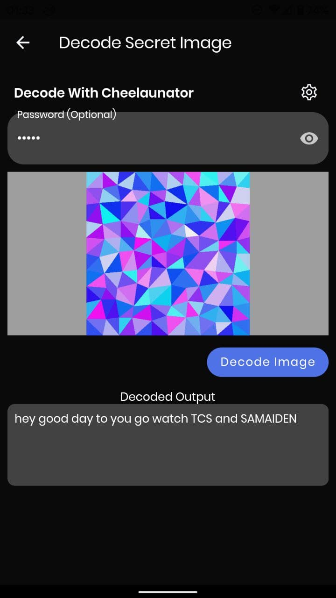
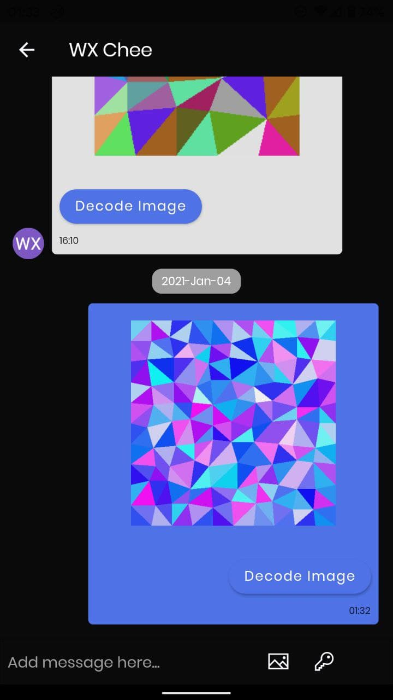
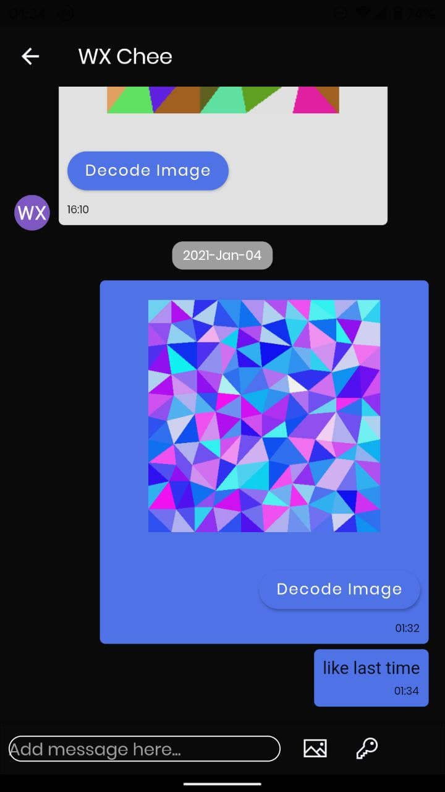

# imageChat

A Flutter project for FYP client side. The pattern Image feature allow you send image with hidden message.

## Compiled

The application is compiled under:

- `Flutter 1.25.0-8.1.pre`
- `Framework • revision 8f89f6505b`
- `Engine • revision 92ae191c17`
- `Tools • Dart 2.12.0 (build 2.12.0-133.2.beta)`

## Getting Started

This project is a starting point for a Flutter application.

List files/directories are main files/directories:
- model: model or dto of object
- service: consume API
- util: utility for the project
- view: UI (page or widget)
- viewmodel: viewmodel
- logger.dart: for logging and err checking
- locator.dart: registration of service
- main.dart: starting point of the program

A few resources to get you started if this is your first Flutter project:

- [Lab: Write your first Flutter app](https://flutter.dev/docs/get-started/codelab)
- [Cookbook: Useful Flutter samples](https://flutter.dev/docs/cookbook)

For help getting started with Flutter, view flutter
[online documentation](https://flutter.dev/docs), which offers tutorials,
samples, guidance on mobile development, and a full API reference.

## Hive
Compile Hive model

`flutter packages pub run build_runner build --delete-conflicting-outputs`

## Application View

### Authentication

  

### Pattern Image Generation
  

